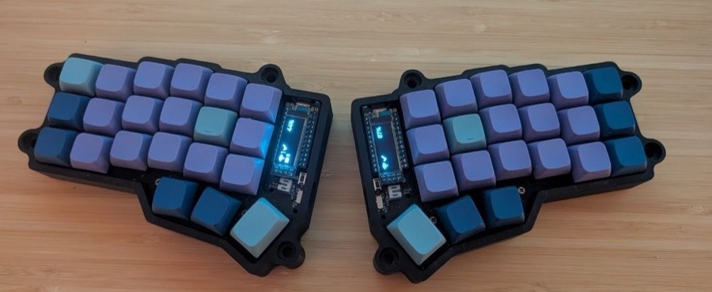
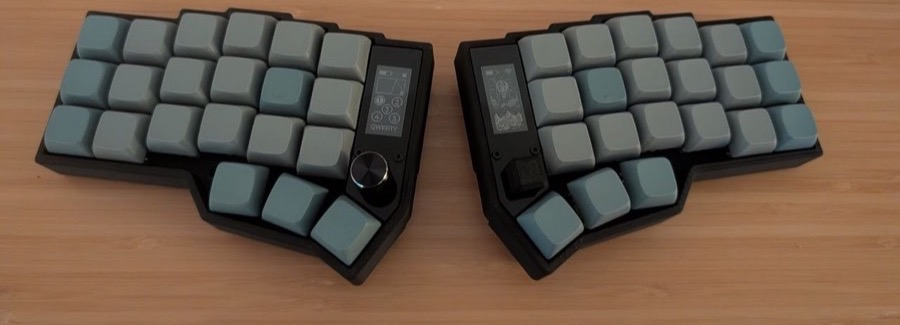

# zmk-config-corne

ZMK firmware configuration shared between two keyboards:

## Corne

## Eyelash Corne

## Layout

### Eyelash extras

The Eyelash Corne adds a joystick and rotary encoder; bindings on top of the
shared layout above:

| Layer    | Joystick   | Joystick click | Encoder rotate | Encoder click |
|----------|------------|----------------|----------------|---------------|
| Default  | Mouse move | Left click     | Volume ±       | Mute          |
| Numbers  | Arrow keys | Enter          | Scroll ±       | —             |
| Symbols  | —          | —              | PgUp / PgDn    | —             |
| Settings | RGB brightness ± (U/D), RGB on/off (L/R) | Cycle effect | Backlight ± | RGB speed |

## Usefull links

- [Keymap Editor](https://nickcoutsos.github.io/keymap-editor/)
- [Keymap Drawer](https://github.com/caksoylar/keymap-drawer)
- [Eyelash Corne ZMK Module](https://github.com/a741725193/zmk-new_corne)
